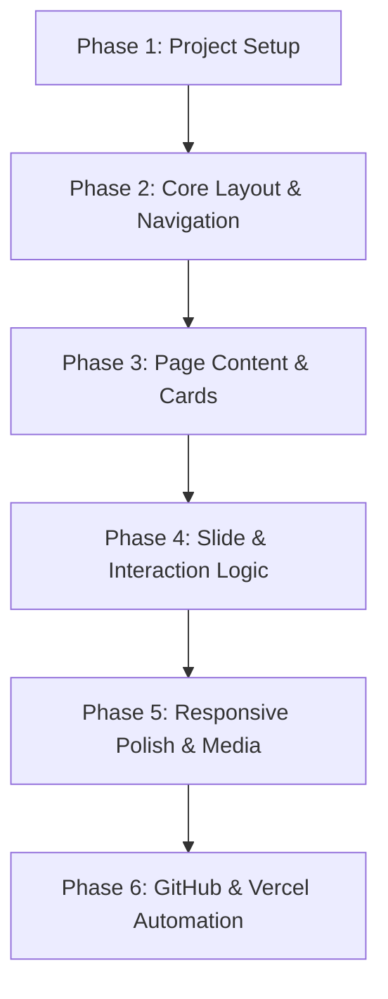

# Portfolio Project Roadmap: Adhithi Kandhi

This document outlines the step-by-step roadmap for building, testing, and deploying the premium portfolio website for **Adhithi Kandhi**. The design is built around an **Orange and Off-White / Cream** color palette, leveraging **Tailwind CSS** for responsive layout and animations, and featuring an elegant **horizontal page sliding (left to right)** navigation scheme.

---

## 🎨 Design System & Aesthetics

### 1. Color Palette
*   **Primary Accent (Orange)**: `#f97316` (Tailwind `orange-500`) & `#ea580c` (Tailwind `orange-600`)
*   **Background (White/Cream)**: `#fffaf4` (Warm cream off-white) & `#ffffff` (Pure white)
*   **Neutral Dark (Charcoal)**: `#1c1917` (Tailwind `stone-900`) - matches the black top in the profile photo
*   **Card Backgrounds**: Soft semi-transparent orange/cream blends with blurred glassmorphism:
    *   `bg-white/80 backdrop-blur-md border border-orange-100 shadow-md shadow-orange-50`

### 2. Typography
*   **Font Family**: `Outfit` or `Inter` from Google Fonts.
*   **Headings**: Bold, elegant, with subtle orange-to-charcoal text gradients.

### 3. Navigation & Sliding Transitions
*   **Mechanism**: A horizontal multi-panel container (`flex flex-row w-[500vw] transition-transform duration-700 ease-in-out`).
*   **Sliding Movement**: Active page is controlled by updating the `transform: translateX(-0vw)`, `translateX(-100vw)`, etc.
*   **Left-to-Right Nav Bar**: Fixed header with sliding underline/active indicator pointing to the active section.

---

## 🗺️ Project Phases & Implementation Steps



### Phase 1: Project Setup & Initialization
*   [ ] Initialize a static repository with HTML, Vanilla JavaScript, and Tailwind CSS.
*   [ ] Set up basic folder structure:
    ```text
    ├── index.html          # Main Entry File
    ├── assets/             # Images & Media (profile.jpg, icons)
    │   ├── profile.jpg     # Enlarged profile image
    │   └── resume.png      # Reference image
    ├── css/
    │   └── style.css       # Custom animations and scrollbar designs
    └── js/
        └── app.js          # Sliding page transition logic
    ```
*   [ ] Integrate Tailwind CSS via Play CDN (for rapid iteration) or Vite for build optimization.
*   [ ] Configure Google Fonts (`Outfit` + `Playfair Display` for headings).

### Phase 2: Core Page Structure & Layout
*   [ ] **Viewport Container**: Set up a wrapper with `overflow-hidden w-screen h-screen relative`.
*   [ ] **Sliding Deck**: Create a `div` containing 5 sections side-by-side:
    *   `Panel 1: Home / Hero`
    *   `Panel 2: About & Skills`
    *   `Panel 3: Projects & Leadership`
    *   `Panel 4: Certifications & Achievements`
    *   `Panel 5: Contact`
*   [ ] **Global Fixed Elements**:
    *   A floating fixed navigation bar (top or side) for quick page jumping.
    *   Social links drawer (GitHub, LinkedIn, CodeChef) fixed to the screen edge.
    *   "Swipe/Arrow" navigation buttons on screen edges.

### Phase 3: Detailed Page Coding
*   **Page 1: Home / Hero (Enlarged Profile Pic)**
    *   [ ] Left column: Bold text introducing Adhithi, links to social profiles, resume download button.
    *   [ ] Right column: **Enlarged Profile Picture** with a stylish soft orange glowing border/background blob and smooth float animation.
*   **Page 2: About & Skills**
    *   [ ] Two-column layout:
        *   **Education cards** (ACE Engineering, Sri Chaitanya MPC, Class 10) in the orange/cream translucent glassmorphism cards.
        *   **Technical Skills grid** with custom progress tags (C, JavaScript, HTML, CSS, Git, VS Code, Vercel, Render).
*   **Page 3: Projects & Leadership**
    *   [ ] Render interactive project showcase cards:
        *   **Food Waste Management System** card with details, tech stack badges, and GitHub link.
        *   **Social Connect Hub** card with features and architecture.
    *   [ ] Add leadership details as a timeline or sleek side card.
*   **Page 4: Certifications & Achievements**
    *   [ ] Standardized certificates grid: Infosys Springboard AI, TCS iON, CodeChef 500, be10x workshop.
    *   [ ] Highlight cards for academic performance (9.7 and 8.7 CGPA).
*   **Page 5: Contact & Resume Reference**
    *   [ ] Responsive contact form styling using orange focus outlines.
    *   [ ] Embed clean link buttons to Email (`adhithikandhi0@gmail.com`), Phone (`8125337023`), and location marker (Hyderabad, India).

### Phase 4: Slide and Swipe Scripting (`js/app.js`)
*   [ ] Implement simple index tracking (`currentIdx = 0`).
*   [ ] Bind click listeners to navbar tabs and next/prev buttons to transition the view.
*   [ ] **Touch / Swipe Gestures**: Add `touchstart` and `touchend` event listeners to support seamless sliding from left to right on mobile screens.
*   [ ] **Keyboard Navigation**: Arrow keys (`ArrowLeft`, `ArrowRight`) support.

### Phase 5: Mobile Responsiveness & Polish
*   [ ] Implement mobile hamburger menu and simple gestures.
*   [ ] Ensure typography scales correctly on smaller viewports (`text-4xl` to `text-6xl` transitions).
*   [ ] Adjust sliding containers to stack vertically on extremely small legacy mobile devices if swipe is disabled, or enforce full landscape/swipe alignment.

### Phase 6: Automated GitHub & Vercel Deployment
*   [ ] Initialize local Git repository: `git init`.
*   [ ] Create a GitHub repository and link it: `git remote add origin ...`.
*   [ ] Commit code: `git add . && git commit -m "feat: complete sliding orange/white portfolio"`.
*   [ ] Push to main: `git push -u origin main`.
*   [ ] **Vercel Setup**:
    *   Link the GitHub repo directly in the Vercel dashboard.
    *   Enable automatic deployments: every push to `main` instantly triggers a production deployment.
    *   Provide live preview URLs on pull requests.

---

## 🧪 Verification and Quality Checklist

1.  **Transition Check**: Swipe or click through all 5 sections. Check for horizontal layout alignment and overflow issues.
2.  **Color Verification**: Contrast ratio verification on orange text against off-white backgrounds (ensure WCAG compliance by using darker orange shades for text, e.g., `#c2410c` or `#9a3412`).
3.  **Image Scaling**: Profile picture scales beautifully on both 4K monitors, laptops, tablets, and small phone screens.
4.  **Form Validation**: Contact form should have appropriate HTML5 validations.
